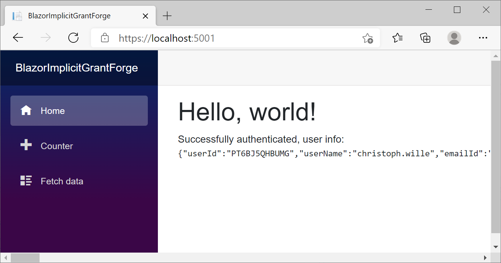
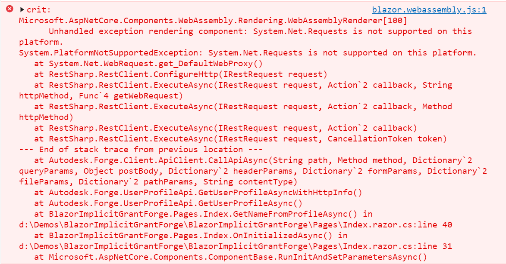

# Blazor Web Assembly accessing Autodesk Forge API

Set your client id in [Index.razor.cs](https://github.com/christophwille/blazor-forge-3legged-implicit/blob/3dad03ea989ad8fca4819543c65427eb11b36ace/BlazorImplicitGrantForge/Pages/Index.razor.cs#L13) (no configuration
has been implemented for this proof of concept).

If unauthorized, Index will show a link to login at Autodesk Forge. Callbacks happen in 
[OAuthCallback.razor.cs](https://github.com/christophwille/blazor-forge-3legged-implicit/blob/3dad03ea989ad8fca4819543c65427eb11b36ace/BlazorImplicitGrantForge/Pages/OAuthCallback.razor.cs), which itself redirects back to Index and then shows the user profile JSON (the URL fragment parsing in OAuthCallback is very brittle).

Note that using the .NET API Client 1.9 from Autodesk does not work - see the implementation of [GetNameFromProfileAsync](https://github.com/christophwille/blazor-forge-3legged-implicit/blob/3dad03ea989ad8fca4819543c65427eb11b36ace/BlazorImplicitGrantForge/Pages/Index.razor.cs#L47) for the detailed textual error message.

